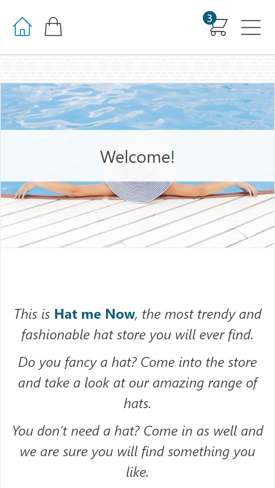

# Hat Me Now
> Fictitious e-commerce website selling hat.
> The store is hosted in vercel [_Click here to take a look._](https://hat-me-now.vercel.app/)

## Table of Contents
* [General Info](#general-information)
* [Technologies Used](#technologies-used)
* [Features](#features)
* [Screenshots](#screenshots)
* [Setup](#setup)
* [Project Status](#project-status)
* [New features](#new-features)
* [Authors](#authors)

## General Information
### Context
The motivator behind this project was to work with React.JS and Google Firebase to create a serverless app. For styling, I decided to use Tailwind CSS to create a completely custom site without the barriers of pre-built components. I had never used Firebase nor Tailwind CSS on a project of my own, so it was a perfect learning exercise to get more used to these technologies.

### Idea
E-commerce website are very popular now. However, there are many that are not fully responsible, slow, or quite sincerely, ugly. Hat Me Now allowed me to work my UX and UI skills in order to create a website that is fully responsive and that handles well.

## Technologies Used
### Front-end
- React
- Tailwind CSS
- Google Firebase

### Database
- Google Firestore

### Deployment and hosting
- Vercel hosting

## Features
So far, I have incorporated the following features:
- Users can search through any of the available hats and add them to their cart.
- Users can login in order to finalise their purchase.
- Users can update and remove items directly from the cart.
- Users can see how many items they have in their cart directly in the navbar.

## Screenshots

## Setup
Classic create-react-app project. Go into the client folder and install dependencies using `npm install`, and then run the development server using `npm start`.

In order to run a local copy, users need to include an .env file with the following information:
- REACT_APP_FIREBASE_API_KEY - Google firebase API key

## Project Status
The project is currently completed, although some additional features might be included in the future.

## New features and bugs
Future features:
- Admin page to update items.
- Google login.
- Add review to items.

## Authors
This project was created by:
- Alejandro Aburto Salazar - [GitHub](https://github.com/aburto22)